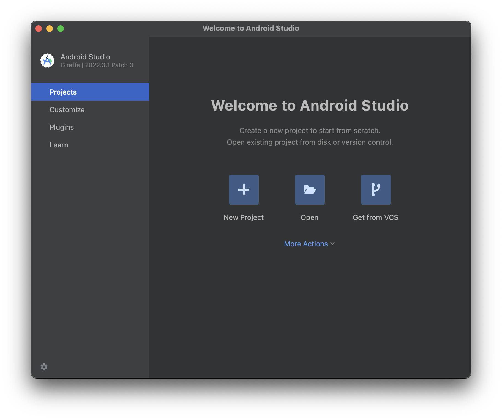

# Aleo Learn & Earn – Mobile dApp Development

- [Aleo Learn \& Earn – Mobile dApp Development](#aleo-learn--earn--mobile-dapp-development)
  - [Pre-requisites](#pre-requisites)
    - [Android Studio](#android-studio)
      - [Installing Android Studio](#installing-android-studio)
      - [Running Android Studio](#running-android-studio)
      - [Installing the NDK](#installing-the-ndk)
      - [Adding the Android Environment Variables](#adding-the-android-environment-variables)
    - [Rust](#rust)
      - [Installing Rust](#installing-rust)
      - [Adding the required Rust targets](#adding-the-required-rust-targets)
    - [Node.js](#nodejs)
      - [Installing Node.js using nvm](#installing-nodejs-using-nvm)
      - [Installing a (better) node package manager](#installing-a-better-node-package-manager)
  - [Creating a Tauri project](#creating-a-tauri-project)

## Pre-requisites

At the risk of stating the obvious, for this workshop we'll need to install some
stuff, so you'll need a package manager like [homebrew](https://brew.sh) if
you're on macOS or
[apt](https://manpages.ubuntu.com/manpages/jammy/man8/apt.8.html) if you're on
Ubuntu. We will only cover setup installations for macOS and Ubuntu, but the
flow for any other Linux distribution should be similar.

I will assume that macOS users have homebrew, with the Xcode command line tools installed.

---

### Android Studio

We will require Android Studio (*and Xcode from the App Store if you wish to build the
app for iOS*) and a number of dependencies to successfuly build our app.

#### Installing Android Studio

<details>
<summary>
macOS
</summary>

If you're on macOS, the process is really simple, you just need to run the following command, and you can immediately start [running Android Studio]

```bash
brew install android-studio
```

</details>

<details>
<summary>Linux</summary>

On Linux, we have to go to the [Android
Studio](https://developer.android.com/studio) website, scroll down and download
`android-studio-2022.3.1.21-linux.tar.gz`.

Assuming you're already in the directory where your download is found, we can extract the required files in an appropriate directory.

```bash
tar -xvf android-studio-2022.3.1.21-linux.tar.gz -C /opt/
```

Now we can install the `64-bit` machine dependencies as stated [here](https://developer.android.com/studio/install#64bit-libs).

```bash
sudo apt-get install libc6:i386 \
                     libncurses5:i386 \
                     libstdc++6:i386 \
                     lib32z1 \
                     libbz2-1.0:i386
```

</details>

#### Running Android Studio

<details>
<summary>
macOS
</summary>

Open the app from Launchpad or `open -a Android\ Studio.app`, and follow through with all the default installation options.

Select the standard installation setting.


</details>

<details>
<summary>Linux</summary>

A recurring theme for this workshop is that Linux people have it slightly harder than macOS peeps.

To run Android Studio, you need to open the script located at

```bash
/opt/android-studio/bin/studio.sh
```

You might want to add the above path to the `PATH` environment variable. I recommend adding the following line to your `.bashrc` or `.zshrc`

```bash
export PATH=$PATH:/opt/android-studio/bin
```

</details>

#### Installing the NDK

At this point, whether you're on macOS or on Linux I will assume you have Android Studio open on the following menu.

<details>
<summary>
macOS/Linux
</summary>



Next up, we're going to install the `Android NDK` tools (~900MB), by going to `More Actions > SDK Manager`, and selecting the `SDK Tools` tab. Make sure you select `NDK (Side by Side)`, the `Android SDK Command-line Tools` and whatever else I have selected, if they weren't installed in the standard installation procedure.


</details>

#### Adding the Android Environment Variables

Now, we need to set some environment variables so that
[Tauri](https://tauri.app), our development framework to recognize the locations
of everything we just installed. As usual, add these to your `~/.bashrc` or `~/.zshrc`.

<details>
<summary>
macOS
</summary>

```bash
export JAVA_HOME="/Applications/Android Studio.app/Contents/jbr/Contents/Home"

export ANDROID_HOME="$HOME/Library/Android/sdk"

export NDK_HOME="$ANDROID_HOME/ndk/26.1.10909125"
```

> [!IMPORTANT]  
> As of writing, the latest NDK version was `26.1.10909125`. This may vary at the time of the workshop, thus you should double check the version you have downloaded and edit the above version accordingly.

</details>

<details>
<summary>
Linux
</summary>

```bash
export JAVA_HOME=/opt/android-studio/jbr

export ANDROID_HOME="$HOME/Library/Android/sdk"

export NDK_HOME="$ANDROID_HOME/ndk/26.1.10909125"
```

> [!IMPORTANT]  
> As of writing, the latest NDK version was `26.1.10909125`. This may vary at the time of the workshop, thus you should double check the version you have downloaded and edit the above version accordingly.

</details>

---

### Rust

Now, we'll proceed by installing Rust and all the CLI tools that we'll need to start building our app.

#### Installing Rust

<details>
<summary>
macOS/Linux
</summary>


```bash
curl --proto '=https' --tlsv1.2 https://sh.rustup.rs -sSf | sh
```

> [!NOTE]
> Before blindly curl-bashing a script, it is always wise to look at it first.

</details>

#### Adding the required Rust targets

Depending on the OS we want to deploy our app to, we must add the appropriate build targets so that the Rust we compile can run on those platforms.

> [!IMPORTANT]
> We can only build iOS apps on macOS, meaning that the targets are only
> installable on macOS. This workshop will be focused on Android, so that everyone
> can follow.

<details>
<summary>
Android
</summary>

```bash
rustup target add aarch64-linux-android \
                  armv7-linux-androideabi \
                  i686-linux-android \
                  x86_64-linux-android
```

</details>

<details>
<summary>
iOS
</summary>

```bash
rustup target add aarch64-apple-ios \
                  x86_64-apple-ios \
                  aarch64-apple-ios-sim

brew install cocoapods
```

> ![WARNING]
> iOS development requires Xcode and is only available on macOS. Be sure that you’ve installed Xcode and not the Xcode Command Line Tools.

</details>

---

### Node.js

Let's install the latest version of Node.js, which as of writing is `21.1.0`.

It's generally good practice to use a version manager for Node.js, so I'll be
using [nvm](https://github.com/nvm-sh/nvm) throughout. That said, any other way that gets a successful output when executing `node -v` works just as well.

#### Installing Node.js using nvm

<details>
<summary>
macOS/Linux
</summary>

```bash
curl -o- https://raw.githubusercontent.com/nvm-sh/nvm/v0.39.5/install.sh | bash

source .{z,ba}shrc

nvm install node
```

</details>

#### Installing a (better) node package manager

I prefer using [pnpm](https://pnpm.io), a package manager that claims to be twice as fast as good ol' [npm](https://github.com/npm/cli). Of course, feel free to use [yarn](https://yarnpkg.com) or whatever gets the job done.

<details>
<summary>
macOS/Linux
</summary>

```bash
curl -fsSL https://get.pnpm.io/install.sh | sh -
```

</details>

## Creating a Tauri project
